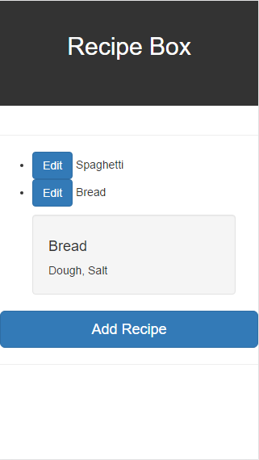
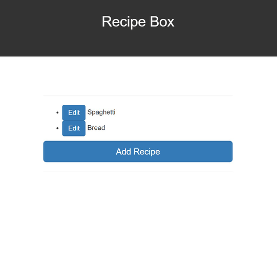

# [Recipe Box](https://antonderegt.github.io/fcc/datavisualization/react/recipebox/build/)


A Flask application template with the boilerplate code already done for you.


**Check it out here [https://antonderegt.github.io/fcc/datavisualization/react/recipebox/build/](https://antonderegt.github.io/fcc/datavisualization/react/recipebox/build/).**

## What's included?

* Two Sample Recipes
* Ability to add a new recipe
* Ability to edit a recipe
* Ability to remove a recipe

## Demos

Home Page:



Adding a recipe:

<!--  -->

Editing a recipe:

<!--  -->

Removing a recipe:

<!--  -->

## Setting up

##### Clone the repo

```
$ git clone https://github.com/antonderegt/fcc.git
$ cd datavisualization/react/recipebox
```

##### Install the dependencies

```
$ npm install
```

##### Start development server

```
$ yarn start
```


##### Running the app

```
$ yarn build
```
Once the build finishes just open the index.html (with your browser) in the folder: build/

## Main Tech Stack
* [React](https://facebook.github.io/react/)
* [Create React App](https://github.com/facebookincubator/create-react-app)
* [React Bootstrap](https://react-bootstrap.github.io/)

## Contributing

Contributions are welcome! Check out this project's GitHub issues. Please refer to our [Code of Conduct](./CONDUCT.md) for more information.

## License
[MIT License](LICENSE.md)
